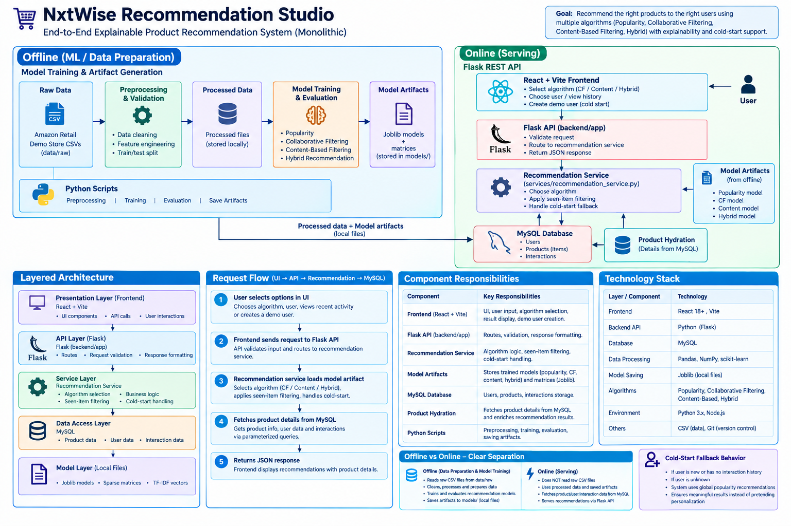
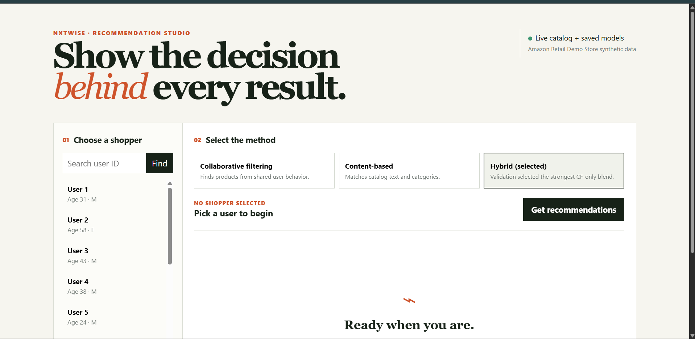
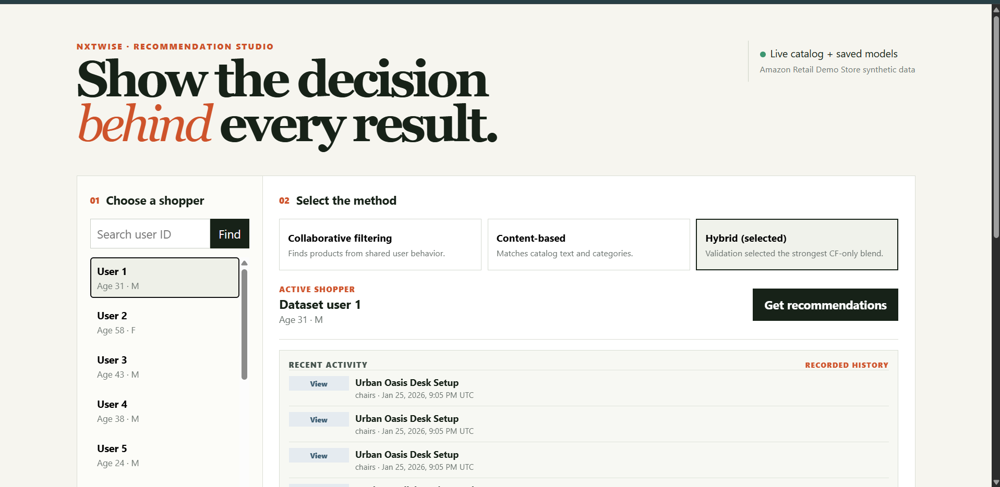
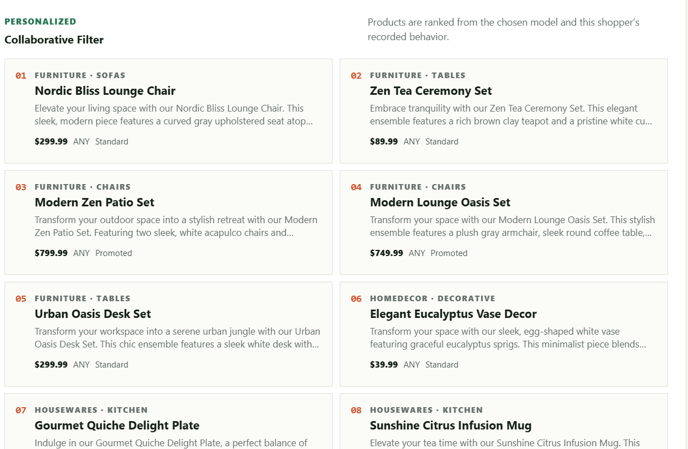

# NxtWise Recommendation Studio

> An explainable product recommendation system that lets reviewers compare collaborative filtering, content-based recommendations, and the validation-selected hybrid—using real catalog data and transparent cold-start behavior.

---

## Project overview

NxtWise Recommendation Studio is an end-to-end e-commerce recommender built for the NxtWise hiring assessment. It takes a user’s recorded product interactions, ranks unseen products, hydrates those product IDs with real catalog details from MySQL, and displays the outcome in a React interface.

The application is deliberately transparent:

- Choose **CF**, **Content-based**, or **Hybrid** in the UI to compare actual model behavior.
- Select a real dataset user to see their recent recorded activity beside the recommendations.
- Create a temporary new demo user to show the popularity-based cold-start fallback.
- See the response route: personalized or cold start.

## Problem definition

Given a shopper’s prior interactions with products, recommend a ranked Top-N list of **unseen** products that they are likely to interact with next.

The project must also serve users without history. For anonymous, unknown, or empty-candidate users, it returns global popularity recommendations rather than pretending those results are personalized.

### Model outcome

Four approaches were evaluated under the same global time-based split:

| Model | Test Precision@10 | Test Recall@10 | Test NDCG@10 |
| --- | ---: | ---: | ---: |
| Popularity baseline | 0.004352 | 0.041758 | 0.018441 |
| TF-IDF content-based | 0.003912 | 0.036557 | 0.026511 |
| Item-based collaborative filtering | **0.066110** | **0.549275** | **0.354436** |
| Validation-selected hybrid | **0.066110** | **0.549275** | **0.354436** |

The hybrid’s validation search selected **CF weight 1.00** and content weight 0.00. That is why CF is the final personalized engine: adding the current content representation did not improve validation ranking quality. Full methodology and uncertainty analysis are in [docs/EVALUATION.md](docs/EVALUATION.md).

## Dataset information

The frozen source is the **Amazon Retail Demo Store synthetic e-commerce dataset**. No other dataset is used.

| File | Role | Size / shape |
| --- | --- | --- |
| `interactions.csv` | User event history | 675,004 rows × 5 columns |
| `items.csv` | Product catalog | 2,465 rows × 8 columns |
| `users.csv` | Shopper attributes | 6,000 rows × 3 columns |

The event history contains `View`, `AddToCart`, `ViewCart`, `StartCheckout`, and `Purchase`. The collaborative model uses every verified interaction as a binary behavioral signal; it does **not** claim that purchases are the only preference signal.

Raw data is immutable and Git-ignored. The reproducible preprocessing pipeline writes validated processed data, which is loaded into MySQL for API catalog/user/activity lookups.

## Technology stack

| Layer | Technologies |
| --- | --- |
| Offline data and ML | Python, Pandas, NumPy, SciPy, scikit-learn, Joblib |
| Recommendation methods | Popularity baseline, sparse item-item cosine CF, TF-IDF content similarity, validation-selected hybrid |
| Data store | MySQL, PyMySQL |
| API | Flask, Pytest |
| UI | React 19, Vite 6 |
| Quality checks | Pytest, real MySQL/model API integration test, Vite production build, npm audit |

## System architecture



The API never stores sparse matrices or model artifacts in MySQL. It reads saved model files locally and uses parameterized, read-only SQL queries to enrich returned product IDs with verified catalog information.

## Interface preview

The reviewer interface keeps the recommendation workflow visible: select a dataset user, inspect recorded activity, choose a method, and generate a labeled Top-10 list. When a list is ready, the page moves directly to the result heading; recent activity initially stays compact and can be expanded when needed.



*Dashboard state: user selection and method selection are available before ranking begins.*



*Known-user state: recent events are factual context from the dataset, not a claim that one event caused one recommendation.*



*Result state: a visible route label distinguishes personalized rankings from cold-start popularity output.*

## Setup instructions

### 1. Prerequisites

- Python 3.14 (or a compatible Python environment)
- Node.js and npm
- MySQL running locally
- The project’s processed data, saved model artifacts, and database load completed through the earlier phases

### 2. Configure MySQL

Ensure the project-root `.env` contains valid local MySQL settings. Do not commit this file.

```env
MYSQL_HOST=localhost
MYSQL_PORT=3306
MYSQL_DATABASE=nxtwise_recommender
MYSQL_USER=your_local_user
MYSQL_PASSWORD=your_local_password
```

If the database has not been loaded yet, follow [docs/MYSQL_SETUP.md](docs/MYSQL_SETUP.md).

### 3. Install Python dependencies

From the project root:

```powershell
cd D:\nextwise
& "C:\Users\Harshith Varma\AppData\Local\Python\pythoncore-3.14-64\python.exe" -m pip install -r requirements.txt
```

### 4. Install UI dependencies

```powershell
cd D:\nextwise\frontend
npm install
```

### 5. Start the API

Open a terminal at `D:\nextwise` and keep it running:

```powershell
& "C:\Users\Harshith Varma\AppData\Local\Python\pythoncore-3.14-64\python.exe" -m flask --app backend.run run --host 127.0.0.1 --port 5000
```

The health endpoint is available at `http://127.0.0.1:5000/api/health`.

### 6. Start the UI

Open a second terminal:

```powershell
cd D:\nextwise\frontend
npm run dev
```

Open **http://127.0.0.1:5173** in a browser.

## Usage instructions

### Demonstrate personalized recommendations

1. Choose a real dataset user from the left panel.
2. Read their **Recent activity** panel. It lists the latest real event type, product, category, and UTC time.
3. Select one method:
   - **Collaborative filtering** — related products inferred from shared behavior among users.
   - **Content-based** — products similar in verified names, descriptions, categories, and catalog gender.
   - **Hybrid** — the validation-selected hybrid; currently a CF-only blend because that was the best measured configuration.
4. Select **Get recommendations**.
5. Inspect the route label, product cards, catalog categories, price, and promotion state.

### Demonstrate cold start

1. Select **Create new demo user**.
2. The UI honestly displays “No history.”
3. Select **Get recommendations**.
4. The result is labeled **COLD START / popularity cold start**.

The new user is temporary. It is never written to MySQL and does not contaminate the dataset or model evaluation.

## API quick reference

| Endpoint | Example |
| --- | --- |
| Health | `GET /api/health` |
| Dataset users | `GET /api/users?limit=12` |
| Recent activity | `GET /api/users/1/activity?limit=8` |
| CF recommendations | `GET /api/recommendations?algorithm=cf&user_id=1&limit=10` |
| Content recommendations | `GET /api/recommendations?algorithm=content&user_id=1&limit=10` |
| Hybrid recommendations | `GET /api/recommendations?algorithm=hybrid&user_id=1&limit=10` |
| Cold start | `GET /api/recommendations?algorithm=hybrid&limit=10` |

See [docs/API_CONTRACT.md](docs/API_CONTRACT.md) for the full response and error contracts.

## Testing and verification

```powershell
# Fast unit/contract suite
& "C:\Users\Harshith Varma\AppData\Local\Python\pythoncore-3.14-64\python.exe" -m pytest backend\tests -q

# Final real integration test: requires local MySQL + saved model artifacts
$env:RUN_LIVE_API_TESTS = "1"
& "C:\Users\Harshith Varma\AppData\Local\Python\pythoncore-3.14-64\python.exe" -m pytest backend\tests\test_api_integration.py -q

# Production UI build and dependency audit
cd frontend
npm run build
npm audit --omit=dev
```

The final live test checks health, real catalog users, CF/content/hybrid routes, hydrated products, recorded activity, cold-start fallback, and expected invalid-request responses.

---

### Project notes

- This project uses a synthetic e-commerce dataset and AI coding assistance.
- Metrics are executed results, not estimates. See [docs/EVALUATION.md](docs/EVALUATION.md).
- Model artifacts and raw data are intentionally Git-ignored.
- Delivery status: Phases 0–14 are complete. The model-selection boundary is frozen; future work should be maintenance or a separately documented new experiment, never test-set retuning.

## References and acknowledgements

### Dataset

- **Amazon Retail Demo Store synthetic e-commerce dataset** — the sole project dataset. The raw source files are [interactions.csv](https://code.retaildemostore.retail.aws.dev/csvs/interactions.csv), [items.csv](https://code.retaildemostore.retail.aws.dev/csvs/items.csv), and [users.csv](https://code.retaildemostore.retail.aws.dev/csvs/users.csv). They are downloaded and retained unchanged; all project transformations are performed by reproducible local scripts.

### Core libraries and frameworks

- [Python](https://www.python.org/), [Pandas](https://pandas.pydata.org/), [NumPy](https://numpy.org/), and [SciPy](https://scipy.org/) for validation, preprocessing, sparse data processing, and analysis.
- [scikit-learn](https://scikit-learn.org/) for TF-IDF features and nearest-neighbor/cosine-similarity utilities; [Joblib](https://joblib.readthedocs.io/) for saved model artifacts.
- [Flask](https://flask.palletsprojects.com/) and the MySQL Python connector for the REST API and catalog access.
- [MySQL](https://www.mysql.com/) for relational user, product, and interaction data.
- [React](https://react.dev/) and [Vite](https://vite.dev/) for the reviewer-facing web interface.
- [Pytest](https://docs.pytest.org/) for unit, contract, and opt-in live integration tests.

### AI assistance disclosure

This project was developed with assistance from **OpenAI Codex** , **claude** for implementation support, debugging, test design, and documentation drafting. Dataset inspection, preprocessing decisions, executed experiments, metric values, and final verification results are represented only when produced from the project’s local code and configured data; AI assistance did not replace empirical evaluation.
